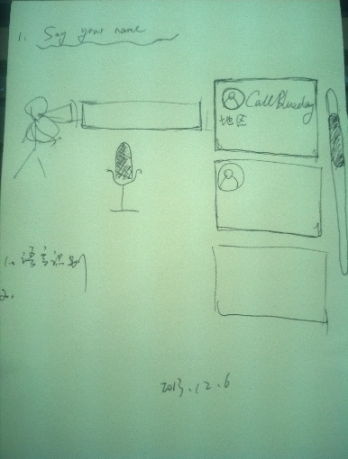

say your name
-------
This is a project that you tell the computer your name, 
and the robot will show your info and record it in the system list.

I would like to show the accurate informaion about you. And I 
wonder, whether the computer would find everything about you in 
the internet at the current time throught your voice. And I also want to konw, whether it is exciting if you would be shown by a certain accurate voice.

What would it be like? It‘s just a joke. You could contact callblueday@gmail.com

#### 准备第一阶段展示的数据
1. 识别声音
1. 将识别出来的声音记录在列表中

#### 待准备的技术列表
1. web 
1. 地理位置检测
1. 声音男女检测
1. xml 记录数据

#### 相关参考资源
- [Web Speech API Demonstration](https://www.google.com/intl/en/chrome/demos/speech.html)
- [Web Speech API Specification](https://dvcs.w3.org/hg/speech-api/raw-file/tip/speechapi.html)

#### 设计草稿
- 

